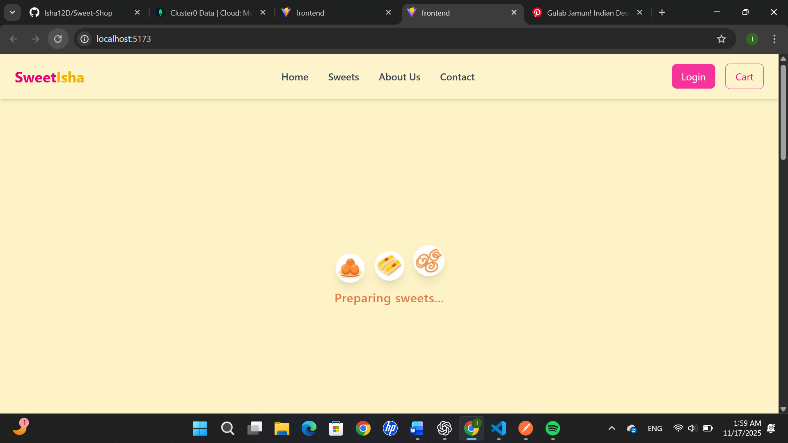
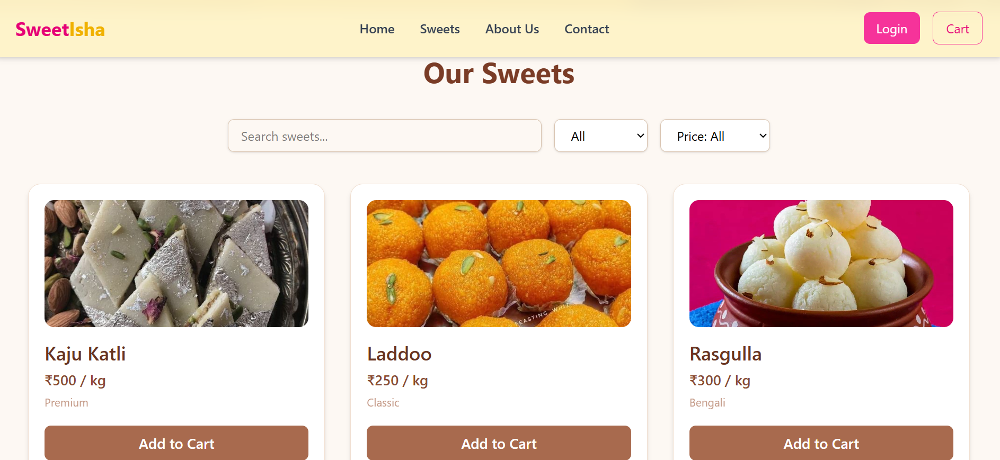
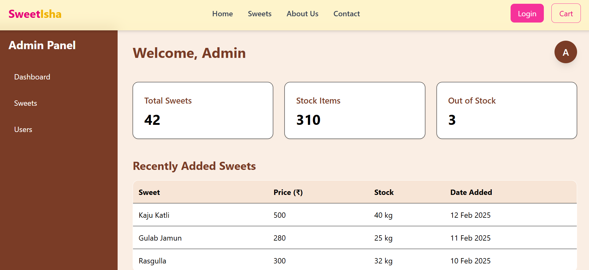

# Project Title

## 1. Overview

The Sweet Shop Management System is a visually appealing and fully functional web application designed to simplify and modernize how a sweets store manages its products and interacts with customers. The project consists of two major parts — Admin Panel and User Storefront, providing a complete end-to-end workflow.

---

## 2. ✨ Features Overview


### 👨‍🍳 **User Interface**

#### **Elegant Hero Section**
- Animated loader (jumping sweets)
- Infinite looping video background
- Soft, premium sweet-shop theme

#### **Sweets Section**
- High-quality sweet images
- Displays name, price, and available stock
- Increment / decrement buttons for quantity
- Dummy search bar
- Category & price filter options
- Fully mobile-responsive UI


### 🛠️ **Admin Panel**

- Secure **JWT-based login**
- Interactive admin dashboard with:
  - Total sweets count
  - Stock overview
  - Quick action buttons
- Full inventory control:
  - Add new sweets
  - Edit sweet details (price & quantity)
  - Manage entire stock efficiently

### 🔐 **Authentication**

- Separate **User** and **Admin** login flows
- Tokens stored securely using `localStorage`
- Automatic role-based redirection
- User initials displayed in navbar after login

---


## 3. Tech Stack

### **Frontend:**

* React Vite + Tailwind CSS 

### **Backend:**

* Node.js + Express  + Typescript

### **Database:**

* MongoDB 

---

## 4. Installation & Setup Instructions

Follow these steps to run the project locally.

---

## **Backend Setup**

### **1. Clone the repository**

```bash
git clone https://github.com/Isha12D/Sweet-Shop
cd project/backend
```

### **2. Install dependencies**

```bash
npm install
```

### **3. Create environment variables**

Create a `.env` file:

```
PORT=5000
DB_URL=your_database_url
JWT_SECRET=your_secret
```

### **4. Start the backend**

```bash
npm start
```

Backend runs at:

```
http://localhost:5000
```

---

## **Frontend Setup**

### **1. Navigate to frontend folder**

```bash
cd project/frontend
```

### **2. Install dependencies**

```bash
npm install
```

### **3. Run the frontend**

```bash
npm run dev
```

Frontend runs at:

```
http://localhost:5173
```

---

## 5. Screenshots

### **Home Page**



### **Dashboard**



### **Admin Dashboard**


---

## 6. Folder Structure

```
project/
├── backend/
│   ├── controllers/
│   ├── routes/
│   ├── models/
│   ├── server.js
│   └── package.json
├── frontend/
│   ├── src/
│   ├── index.html
│   └── package.json
└── README.md
```

---

## 7. My AI Usage

I used AI (ChatGPT) for the following tasks:

* Drafting the README.md structure.
* Getting help with wording installation steps.
* Improving explanation clarity.
* Formatting markdown sections.

All the implementation, logic, and final documentation decisions were made by me.


